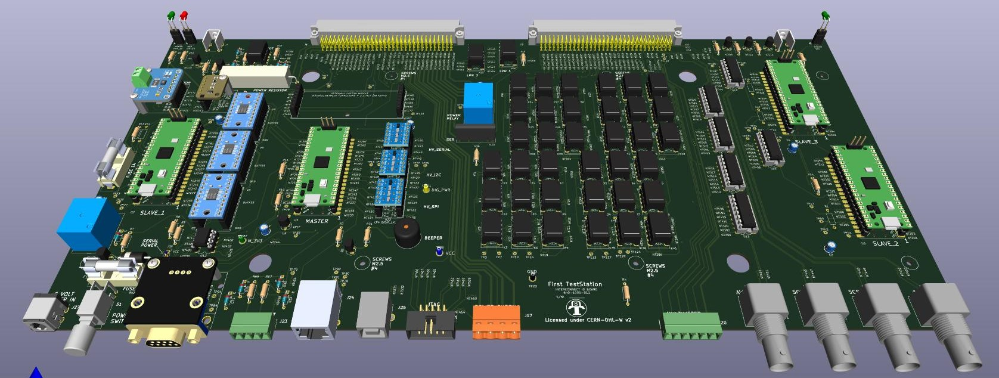

# FIRST STATION TEST Interconnect IO Board 600-1000-011

## Project Overview
This project involves the assembly of a custom **Interconnect IO Circuit Board (PCB)** designed to be part of the **First Test Station** project ([FTS](https://dlock8.github.io/FTS_Website/)). The primary goal of the Interconnect IO board is to provide an interface between instruments and the Unit Under Test (U.U.T).

Many resources, such as **bank relays**, **power relays**, **Digital IO** and **communication interfaces**, have been integrated into the Interconnect IO board. These resources reduce the need for external instruments and maximize the versatility of the interface, allowing for efficient testing and broader functionality.

 

### Design Tools
- [KiCad 7](https://www.kicad.org/download/) - Free software application used to design the PCB.
- [LibreOffice](https://www.libreoffice.org/download/download-libreoffice/) - Free Software application used to create assembly instructions and the Bill of Materials (BOM).
- [PicPick](https://picpick.app/en/) - Free application to capture and document image.

---
### Features
- **Easy Hand Assembly**: Designed with only through-hole components, making it easy to assemble by hand.
- **Socketed Active Components**: To facilitate easy replacement without unsoldering, most active components are mounted on sockets.
- **Cost-Effective Controller**: The low-cost and powerful **Raspberry Pi Pico Microcontroller** is used to interface with the user and control internal electronics.

## Assembly Instructions
   Follow the document [Assembly_Instructions](interconnectIO_bd/pdf/Interconnect_IO_Assembly_Instruction.pdf) to complete the assembly of the board.

## Design Files
- [Gerber Files](interconnectIO_bd/gerber_to_order/) – Gerber files for PCB fabrication, send zip file to manufacturer (JLCPCB is the one used by the project).
- [Assembly Schematic](interconnectIO_bd/pdf/Interconnect_IO_Assembly_diagram.pdf) – Parts and value to help hand assemblies of components.
- [Electrical Schematic](interconnectIO_bd/pdf/interconnect_IO_schematic.pdf) – Review the full electrical schematic diagram for reference.
- [Bill of Materials (BOM)](interconnectIO_bd/pdf/BOM_Interconnect_IO_Board_600-1000.pdf) – List of components required for assembly.

---

## License

This project is licensed under the terms of the [CERN Open Hardware Licence Version 2 - Weakly Reciprocal (CERN-OHL-W 2.0)](https://ohwr.org/cern_ohl_w_v2.txt).

See the [LICENSE](./LICENSE) file in this repository for more details.

---

## History
- **Version 1.0**: The initial version of the PCB (600-1010-010) has been assembled and tested. Wiring errors on the UART were identified and corrected manually using wires.
- **Version 1.1**: This version addresses all errors identified in Version 1.0. As of now, Version 1.1 has not yet been assembled or tested.
---

## Contact
For any issues or further questions, feel free to contact me at [daniellockhead@gmail.com] or open an issue on GitHub.

---

